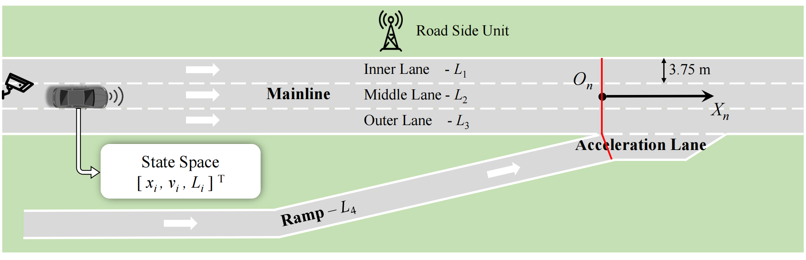
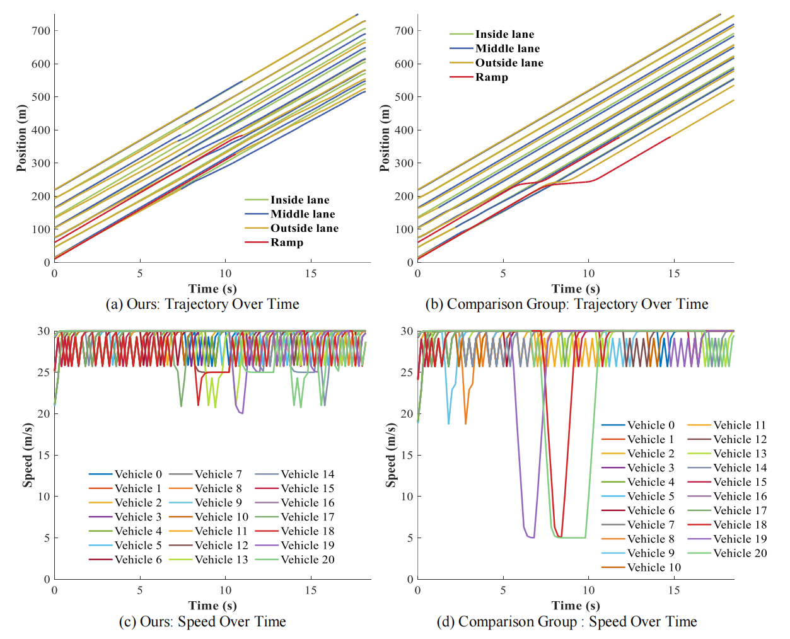
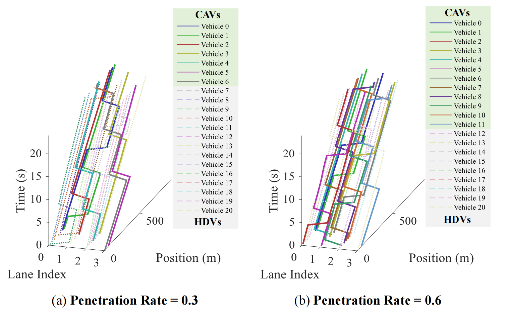

# Optimized Control Method for Cooperative On-Ramp Merging of Connected Vehicles Based on Discretized Spatial Feature Modeling

This study proposes a discretized spatial feature modeling method for ramp merging areas. By constructing dynamic target trajectory prediction features, heterogeneous traffic features, and ramp flow radiation features, valuable information in the space is quantified. This information is stored in discretized, equally-sized rectangular segments and concatenated into a fixed-dimensional feature matrix. Based on this model, a multi-vehicle cooperative control method using a rolling optimization strategy with priority sequencing is developed to evaluate and select optimal actions for each vehicle. The control algorithm was comprehensively evaluated in mixed-traffic scenarios and demonstrated effectiveness. 

## Installation
- create an python virtual environment: `conda create -n MARL python=3.8 -y`
- active the virtul environment: `conda activate MARL`
- install pytorch : `pip install torch===2.4.1 torchvision===0.19.1 torchaudio===2.4.1 -f https://download.pytorch.org/whl/torch_stable.html`
- install the requirements: `pip install -r requirements.txt`
  
<p align="center">
     
     <br>Fig.1 Illustration of the considered on-ramp merging traffic scenario.
</p>


## Demo
[see the site](https://www.bilibili.com/video/BV1oLotYREE4/)

## Usage
To run the code, just run it via `python test_env.py`.  The `busyness_map.py` is the core algorithm which is a discretized spatial feature modeling method for ramp merging areas.

## Results curves
<p align="center">
     
     <br>Fig.2 The position curve and velocity curve in the control process.
</p>

<p align="center">
     
     <br>Fig.2 Variation of vehicle position under different penetration rates in a mixed traffic scenario.
</p>

To reproduce, we test the algorithms for about 500 random seeds, which can be set in `test_env.py`.

## Cite
<!-- ```
@book{chen2023deep,
  title={Deep Multi-Agent Reinforcement Learning for Efficient and Scalable Networked System Control},
  author={Chen, Dong},
  year={2023},
  publisher={Michigan State University}
}
```

```
@article{chen2023deep,
  title={Deep multi-agent reinforcement learning for highway on-ramp merging in mixed traffic},
  author={Chen, Dong and Hajidavalloo, Mohammad R and Li, Zhaojian and Chen, Kaian and Wang, Yongqiang and Jiang, Longsheng and Wang, Yue},
  journal={IEEE Transactions on Intelligent Transportation Systems},
  year={2023},
  publisher={IEEE}
}
``` -->
## Reference
- [Highway-env](https://github.com/eleurent/highway-env)
